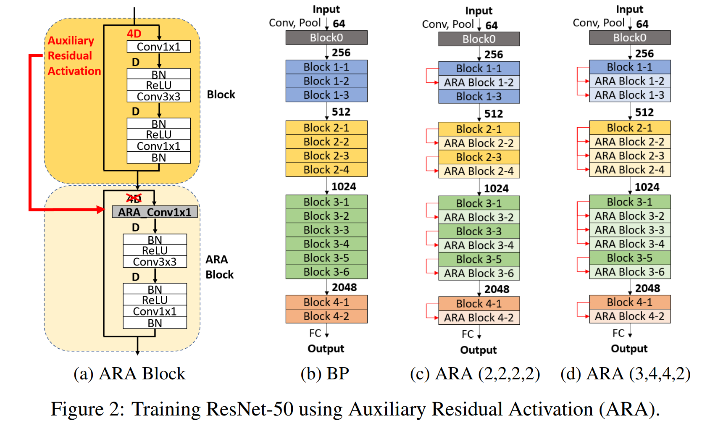
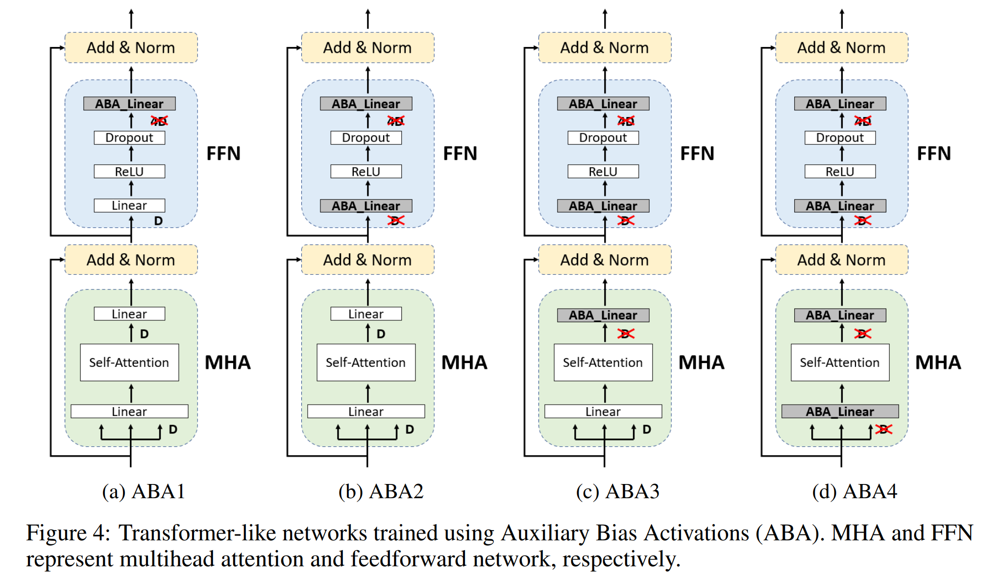
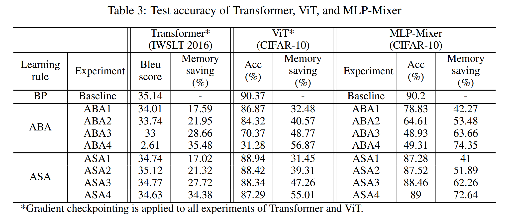

# Learning-with-Auxiliary-Activation-for-Memory-Efficient-Training

This repository is the official implementation of Auxiliary-Activation-Learning. 

+ The proposed learning rule store auxiliary activations instead of actual input activations during forward propagation.
+ The proposed learning rule reduces training memory requirements without additional recomputation while achieving high performance close to backpropagation.
+ Details can be found in our paper (https://openreview.net/forum?id=w1JAXsQqdm).  

<p align="center">
 
<p align="center">

## Requirements

To install requirements:

```setup
conda env create -f aal.yaml
conda activate aal
```
## Data 

 We prepaired Tiny-ImageNet and IWSLT-2016 as follow: [data](https://drive.google.com/drive/folders/1gogdZW1AUolzVuYBm86r0cIiKo8m32aL?usp=sharing)
 
ImageNet also can be downloded by [here](https://www.image-net.org/download).
 
Before training, you have to download this data and put them on data folder in ResNet and Transformer dir. 
 
## Training

See help (--h flag) for available options before executing the code.

`train.py` is provided to train the model.
 
 When you want to train the ResNet
 
```train
cd ResNet
python train.py --dataset <type of dataset> --model <type of model> --learning-rule <type of learning-rule> 
```

For instance, to train resnet152 model on ImageNet dataset with our ARA (3, 4, 2, 2) with gradient checkpointing, run:

```train_res18
cd ResNet
python train.py --dataset imagenet --model resnet152 --learning-rule ara --ARA-stride 3 4 2 2 --gcp --device 0 1 2 3 4 5
```

The other experiments in Transformer, ViT, MLP-Mixer could be performed by 
 
```train_res18
cd Transformer
python train.py --batch_size 4096 --dataset_name IWSLT --language_direction G2E --learning_rule asa2 --gcp True --device 0 --get_li True
```

```train_res18
cd ViT
python train.py --dataset c10 --label-smoothing --autoaugment --get-li --device 0 --learning-rule asa1
```
 
```train_res18
cd MLP-Mixer
 python train.py --dataset c10 --model mlp_mixer --autoaugment --cutmix-prob 0.5 --learning-rule asa4 --get-li --device 0
```

 
 
## Pretrained Models
 
 We prepaired some pretrained model which can do evaluate as follow: [pretrained_model](https://drive.google.com/drive/folders/19YTFrFeGqffV9wjsTz2QygiOGMdVYlTB?usp=sharing)
 
## Evaluation

See help (--h flag) for available options before executing the code.

`eval.py` is provided to evaluate the model.

```eval
cd ResNet
python train.py --dataset <type of dataset> --model <type of model> --learning-rule <type of learning-rule> --model_path <path/to/model>
```


## Results

The evaluation results of our code are as follows:
  
<p align="center">
  
<p align="center">

## Learning Indicator

 If we use 'get-li' arguments in training, <experiments>_li.npy, whch is the results containing distribution of learning indicator, is generated. 
 
 Therefore, `learning_indicator.py` is provided to make graph of the learning distributions.

```li
python learning_indicator.py --li_path <path/to/li>
```

 <p align="center">

 
## Reference Codes
  
  https://github.com/gordicaleksa/pytorch-original-transformer
  
  https://github.com/omihub777/ViT-CIFAR
  
  https://github.com/omihub777/MLP-Mixer-CIFAR
  
  
 ## Lisense

> All content in this repository is licensed under the MIT license. 

