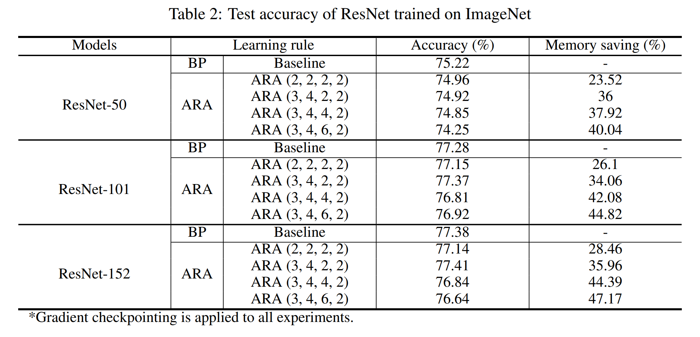

# Learning-with-Auxiliary-Activation-for-Memory-Efficient-Training

This repository is the official implementation of Auxiliary-Activation-Learning. 

+ The proposed learning rule store auxiliary activations instead of actual input activations during forward propagation.
+ The proposed learning rule reduces training memory requirements without additional recomputation while achieving high performance close to backpropagation.
+ Details can be found in our paper .  

<p align="center">
<p align="center">

## Requirements

To install requirements:

```setup
conda env create -f aal.yaml
conda activate asap
```

## Training

See help (--h flag) for available options before executing the code.

`train.py` is provided to train the model.
 When you want to train the ResNet
 
```train
cd ResNet
python train.py --dataset <type of dataset> --model <type of model> --learning-rule <type of learning-rule> 
```

For instance, to train resnet152 model on ImageNet dataset with our ARA (3, 4, 2, 2) with gradient checkpointing, run:

```train_res18
python train.py --dataset ImageNet --model resnet152 --learning-rule ARA --ARA-stride 3, 4, 2, 2 --gcp
```

## Evaluation

See help (--h flag) for available options before executing the code.

`eval.py` is provided to evaluate the model.

```eval
cd ResNet
python train.py --dataset <type of dataset> --model <type of model> --learning-rule <type of learning-rule> --model_path <path/to/model>
```


## Results

The evaluation results of our code is as follows:
  
<p align="center">
  
<p align="center">

## Lisense

> All content in this repository is licensed under the MIT license. 

